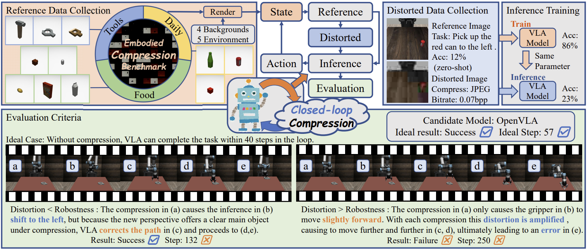
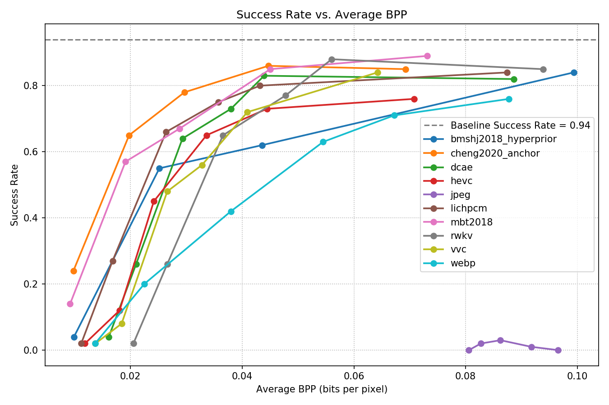
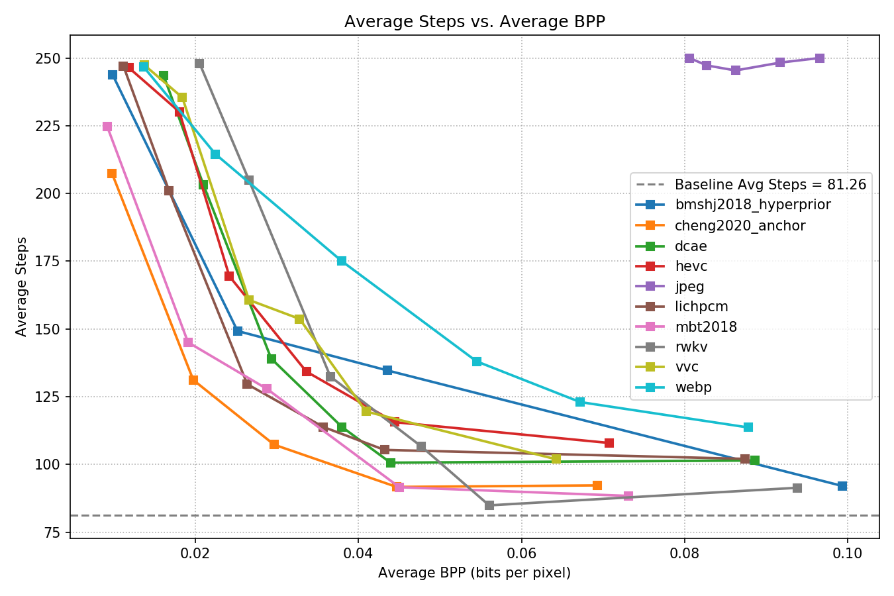

<div align="center">

 <h1>Embodied Image Compression

 The first embodied image compression benchmark
Yuan Tian, Xiangyang Zhu, Zicheng Zhang, Xiaohong Liu, Weisi Lin, Guangtao Zhai
 <div>
      <a href="https://lcysyzxdxc.github.io" target="_blank">Chunyi Li</a><sup>1</sup><sup>2</sup><sup>3</sup><sup>*</sup>,
      <a href="" target="_blank">Rui Qing</a><sup>1</sup><sup>*</sup>,
      <a href="https://scholar.google.com/citations?hl=en&user=Eru2-TYAAAAJ" target="_blank">Jianbo Zhang</a><sup>1</sup>,
      <a href="" target="_blank">Yuan Tian</a><sup>2</sup>,
      <a href="" target="_blank">Xiangyang Zhu</a><sup>2</sup>,
      <a href="" target="_blank">Zicheng Zhang</a><sup>1</sup><sup>2</sup>,
      <a href="" target="_blank">Xiaohong Liu</a><sup>1</sup>,
      <a href="" target="_blank">Weisi Lin</a><sup>3</sup>,
      <a href="https://ee.sjtu.edu.cn/en/FacultyDetail.aspx?id=24&infoid=153&flag=153" target="_blank">Guangtao Zhai</a><sup>1</sup><sup>2</sup>,
 </div>

 <div>
  <sup>1</sup>Shanghai Jiaotong University,  <sup>2</sup>Shanghai AI Lab,  <sup>3</sup>Nanyang Technological University.  <sup>*</sup>contributed equally to this work.
 </div> 
 
 <div style="width: 100%; text-align: center; margin:auto;">
      
 </div>
</div>

EmbodiedComp is a closed-loop benchmark frame for VLA(Vision-Language-Action) model.We use robosuite to build a environment with random texture and objects for an UR5 robotic arm with Pi0-FAST,Pi0.5 and OpenVLA-oft.
To align with Real-world applications of Embodied AI, we deploy the compression algorithm within the Embodied Inference pipeline for the first time, enabling closed-loop validation. Since compression distortion accumulates in each loop-iterations, evaluation metrics include both Success Rate (SR) and the Step for iterations to represent efficiency.

<div align="center">

🤗 [Weight&Dataset Download:]() [Pi](https://huggingface.co/qruisjtu/pi_ur5_fintuned) [Openvla](https://huggingface.co/qruisjtu/openvla_ur5_finetuned) [Image](https://drive.google.com/drive/folders/1uU1vnxE5rk-ok8MNgQ1sgFkZB5UWx3nf?usp=sharing)| 📚 [Paper](https://arxiv.org/abs/2512.11612) | 📈[Benchmark]()

</div>

## Release
- [2026/1/22] [Image dataset](https://drive.google.com/drive/folders/1uU1vnxE5rk-ok8MNgQ1sgFkZB5UWx3nf?usp=sharing) for **EmbodiedComp** is upgrade
- [2026/1/14]   🤗[Huggingface model weight](https://huggingface.co/qruisjtu/pi_ur5_fintuned) for **EmbodiedComp** is upgrade.
- [2026/1/10] 🔥 [Github repo](https-link) for **EmbodiedComp** is online.
- [To Do] [ ] Real-world data.

# Installing
Prepare environment
```bash
git clone https://github.com/Jianbo-maker/EmbodiedComp.git
cd EmbodiedComp
# conda env create (this may take a while)
conda env create -n Ecomp
# activate conda
conda activate Ecomp
```
Or you can prepare environment by 
```bash
pip install -r requirment.txt
```
Install openpi-client:
```bash
cd packages/openpi-client
pip install -e .
cd ../..
```


# Benchmark with openvla
For openvla,run directly(Openvla requires 20GB VRAM for interfacing)
```
python openvla.py
```
It will start downloading weight from huggingface and start benchmark with default settings, you can also change the `BENCHMARK PARAMETERS` in `openvla.py`, including text prompt, benchmark's name, agent's name, etc.
You can change the`pretrained_checkpoint= `in [openvla.py](openvla.py#L69) to your own weight path. 

The benchmark's result will be saved under folder `data/benchmark`
# Benchmark with Pi0&Pi05
We use openpi-client to interact with pi0 and pi0.5, that means you have to start pi agent server first with its own environment.You can see [pisetup](doc/pisetup.md) for our config for ur5 robot.And you can download our finetuned weight [here](https://huggingface.co/qruisjtu/pi_ur5_fintuned). After the pi client is start,you can change the `BENCHMARK PARAMETERS` in `pi.py` including text prompt, benchmarkname, agentname,etc.Then run
```
python pi.py
```
The benchmark's result will be saved under folder `data/benchmark`

# Test your own compress codec
You can modify the image or add your own compress codec in EmbodiedComp to test. To use your own codec, you have to register it and design a Quality-Downsampling table for certain BPP range. 
### 1. Add your codec
You add your own compress codec in the benchmark by changing following lines of code.

- [pi](pi.py#L60) and [openvla](openvla.py#L137)'s function `build_obs_ur5` transfer the camera's image to agent, you can modify our extract the image.
```python
def build_obs_ur5(obs,step:int,iscpr=False,prompt:str=PROMPT) :
    """
    convert observation from mujoco to pi's config format
    You can modify or compress the image from camera here
    """
    state  = np.concatenate((obs["robot0_joint_pos"],[obs["robot0_gripper_qpos"][0]]),axis=0)
    agent_raw = np.ascontiguousarray(obs["agentview_image"][::-1, ::-1]).astype(np.uint8)
    wrist_raw = np.ascontiguousarray(obs["robot0_eye_in_hand_image"][::-1, ::-1]).astype(np.uint8)
    if iscpr: 
        agent_cpr = cpr.compress(agent_raw, saveimg=False)[0]
        wrist_cpr = cpr.compress(wrist_raw, saveimg=False)[0]
        obs_new = {
            "base_rgb": agent_cpr,   
            "wrist_rgb":wrist_cpr,    
            "state":     state,
            "prompt":   prompt,     
        }
        first_frame = [agent_cpr, wrist_cpr, agent_raw, wrist_raw] if step == 0 else None
    else:
        obs_new = {
            "base_rgb": agent_raw,  
            "wrist_rgb":wrist_raw,  
            "state":     state,
            "prompt":   prompt, 
        }
        first_frame = None
    return obs_new , first_frame
```

- Our class [COMPRESSIMG](compress/compressimg.py#L367) ('cpr' in pi\.py) collects many useful codec, you can add your own codec class from base class `Codec` and rewrite its `compress` function, which recieve raw image array(after downsampling if need) and return decoded image array and bits per pixel after compress. Then announce your class in [codecmap](compress/compressimg.py#L372)
Below is an example of Codec from CompressAI
```python
class CompressAICodec(Codec):
    def __init__(self, quality, model_name):
        super().__init__(quality)
        model_map = {
            'mbt2018': mbt2018,
            'mbt2018_mean': mbt2018_mean,
            'cheng2020_attn': cheng2020_attn,
            'bmshj2018_factorized': bmshj2018_factorized,
            'bmshj2018_hyperprior': bmshj2018_hyperprior,
            'cheng2020_anchor': cheng2020_anchor,
        }
        self.net = model_map[model_name](
            quality=quality, metric='mse', pretrained=True, progress=True
        ).eval().to(device)

    def compress(self, image_array):
        tensor = transforms.ToTensor()(image_array).unsqueeze(0).to(device)
        with torch.no_grad():
            out_net = self.net(tensor)
        rec = out_net['x_hat'].clamp_(0, 1).squeeze().cpu()
        rec_np = (rec * 255).clamp(0, 255).byte().permute(1, 2, 0).numpy()
        bpp = self._compute_bpp(out_net)
        return rec_np, bpp
```

We support the following codecs out of the box:
- mbt2018_mean
- mbt2018
- cheng2020_attn
- bmshj2018_factorized
- bmshj2018_hyperprior
- cheng2020_anchor , other codec from compressai is easy to add
- jpeg
- webp
- <span style="color: gray">lichpcm (Additional repo https://github.com/lyq133/LIC-HPCM required)</span>
- <span style="color: gray">dcae (Additional repo https://github.com/CVL-UESTC/DCAE required)</span>
- <span style="color: gray">rwkvcompress (Additional repo https://github.com/sjtu-medialab/RwkvCompress required)</span>
### 2. Design your Quality-Downsampling pair table
To achieve a high compression ratio and easy to compare codecs in same bpp zone, we have to set Quality-Downsample table for different codecs.
```python
MODELQUADOWN={
    "mbt2018":[[1,'1/4'],[1,'1/2'],[1,'3/4'],[1,'1'],[2,'1']],
    "cheng2020_anchor":[[1,'1/4'],[1,'1/2'],[1,'3/4'],[1,'1'],[2,'1']],
    "bmshj2018_hyperprior":[[1,'1/4'],[1,'1/2'],[1,'3/4'],[2,'1']],
    "jpeg":[[5,'1/8'],[10,'1/8'],[20,'1/8'],[40,'1/8'],[10,'1/4']],
    "webp":[[5,'1/8'],[5,'1/4'],[10,'3/8'],[10,'1/2'],[20,'1/2'],[40,'1/2']],
    ...
}
```
for example, [1,'1/4'] refers to choose quality 1 and 1/4 Downsampling.Our parameters are sampled from the upper-left envelope curve in the corresponding BPP range(0.01-0.10) of the “PSNR vs. Downsampling Quality” scatter plot for the respective codec.

With proper pairs of quality-downsampling, you can compare different codecs in same BPP range.For example, we use [0.01-0.1] bpp to align all the codec.
 <div style="width: 100%; text-align: center; margin:auto;">
      
      
 </div>

## Citation

If you find our work interesting, please feel free to cite our paper:

```bibtex
@misc{li2025embodiedimagecompression,
      title={Embodied Image Compression}, 
      author={Chunyi Li and Rui Qing and Jianbo Zhang and Yuan Tian and Xiangyang Zhu and Zicheng Zhang and Xiaohong Liu and Weisi Lin and Guangtao Zhai},
      year={2025},
      eprint={2512.11612},
      archivePrefix={arXiv},
      primaryClass={cs.CV},
      url={https://arxiv.org/abs/2512.11612}, 
}
```
